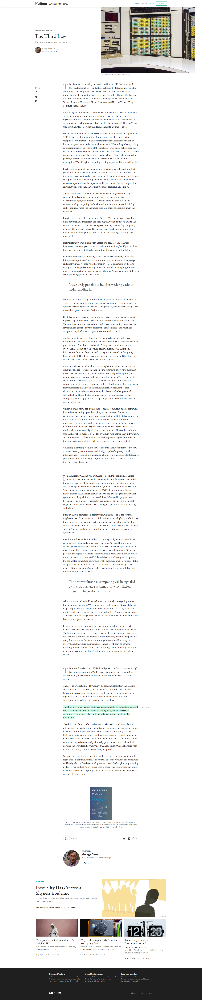

### Block and inline elements

https://medium.com/swlh/understanding-css-display-none-block-inline-and-inline-block-63f6510df93

https://developer.mozilla.org/en-US/docs/Web/HTML/Inline_elements

### Vertical \ horizontal alignment

https://developer.mozilla.org/en-US/docs/Web/CSS/CSS_Box_Alignment

### Size units

https://developer.mozilla.org/en-US/docs/Learn/CSS/Introduction_to_CSS/Values_and_units

https://developer.mozilla.org/en-US/docs/Web/CSS/calc

## Task

Medium.com - article page, desktop only.
Attention to: inline text styling, structure of classes and block styles

